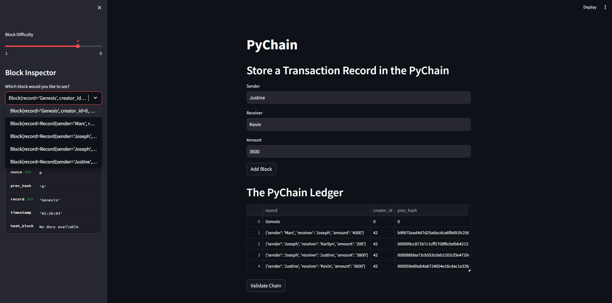
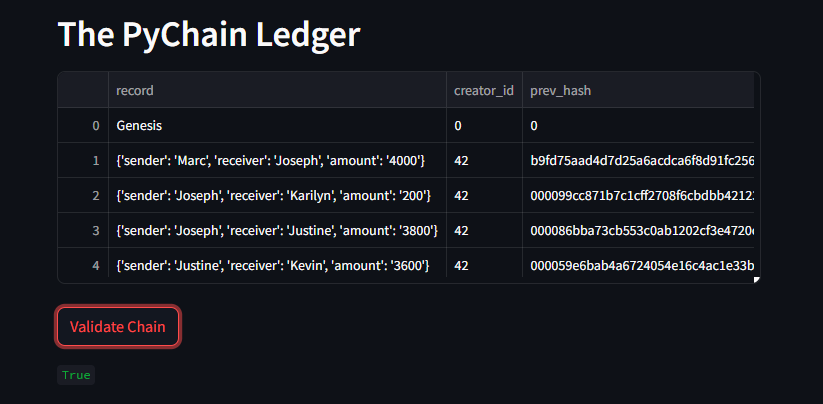

# Blockchain Ledger Demo

In this demo, I will be demonstrating both the ability to both develop a working blockchain as well as develop an application for someone to add to said blockchain.

Above is a screen grab demonstrating the functionality of the Streamlit application built during the challenge.

As you can see from above, the validation of the blockchain returns true indicating that the blockchain has been validated with all previous hashes being congruent with the hash produced by the previous block. This ultimately proves that the blocks in the chain have not been manipulated by outside actors.
